# Testing

> [!NOTE]
> Return back to the [README.md](README.md) file.

## Code Validation

### HTML

I have used the recommended [HTML W3C Validator](https://validator.w3.org) to validate all of my HTML files.

| Directory | File                                                                                             | URL                  | Screenshot                                       | Notes                                     |
| --------- | ------------------------------------------------------------------------------------------------ | -------------------- | ------------------------------------------------ | ----------------------------------------- |
| frontend  | [index.html](https://validator.w3.org/nu/?doc=https%3A%2F%2Ffit-track-front-end.onrender.com%2F) | Link in file section |  | Showed an error but the script was sorted |

### CSS

I have used the recommended [CSS Jigsaw Validator](https://jigsaw.w3.org/css-validator) to validate all of my CSS files.

| Directory      | File                                                                                                                                                                           | URL                  | Screenshot                                               | Notes                                                                                       |
| -------------- | ------------------------------------------------------------------------------------------------------------------------------------------------------------------------------ | -------------------- | -------------------------------------------------------- | ------------------------------------------------------------------------------------------- |
| main live site | [index.css](https://jigsaw.w3.org/css-validator/validator?uri=https%3A%2F%2Ffit-track-front-end.onrender.com%2F&profile=css3svg&usermedium=all&warning=1&vextwarning=&lang=en) | Link in file section |     | This showed a lot of warnings and some errors but majority was because of third-party usage |
| Achieve stars  | [AchievementStars.css](https://jigsaw.w3.org/css-validator/validator)                                                                                                          | Link in file section |   | No warnings                                                                                 |
| Auth           | [auth.css](https://jigsaw.w3.org/css-validator/validator#warnings)                                                                                                             | Link in file section |      | showed warnings but expected                                                                |
| Auto scroll up | [autoScrollUp.css](https://jigsaw.w3.org/css-validator/validator#css)                                                                                                          | Link in file section |        | showed warnings but expected                                                                |
| Chat           | [Chat.css](https://jigsaw.w3.org/css-validator/validator)                                                                                                                      | Link in file section |          | showed no warnings                                                                          |
| Dark theme     | [dark-theme.css](https://jigsaw.w3.org/css-validator/validator)                                                                                                                | Link in file section |    | showed warnings but expected                                                                |
| Dash           | [dash.css](https://jigsaw.w3.org/css-validator/validator)                                                                                                                      | Link in file section |          | showed no warnings                                                                          |
| Delete account | [DeleteAccount.css](https://jigsaw.w3.org/css-validator/validator)                                                                                                             | Link in file section |        | showed no warnings                                                                          |
| Logout         | [logoutModal.css](https://jigsaw.w3.org/css-validator/validator#warnings)                                                                                                      | Link in file section |        | showed warnings but expected                                                                |
| Notification   | [NotificationModal.css](https://jigsaw.w3.org/css-validator/validator)                                                                                                         | Link in file section |  | showed warnings but expected                                                                |
| Profile image  | [ProfileImage.css](https://jigsaw.w3.org/css-validator/validator#warnings)                                                                                                     | Link in file section |       | showed warnings but expected                                                                |
| Setting item   | [SettingItem.css](https://jigsaw.w3.org/css-validator/validator)                                                                                                               | Link in file section |  | showed warnings but expected                                                                |
| Settings page  | [SettingsPage.css](https://jigsaw.w3.org/css-validator/validator)                                                                                                              | Link in file section |  | showed warnings but expected                                                                |
| Workout        | [Workout.css](https://jigsaw.w3.org/css-validator/validator)                                                                                                                   | Link in file section |       | showed warnings but expected                                                                |
| Error          | [ErrorPages.css](https://jigsaw.w3.org/css-validator/validator)                                                                                                                | Link in file section |         | showed warnings but expected                                                                |
| Footer         | [footer.css](https://jigsaw.w3.org/css-validator/validator)                                                                                                                    | Link in file section |        | showed warnings but expected                                                                |
| Header         | [header.css](https://jigsaw.w3.org/css-validator/validator)                                                                                                                    | Link in file section |        | showed warnings but expected                                                                |

### JavaScript

I have used the [ESLint Validator](https://eslint.org/) to validate all of my JS/JSX files.

| Directory                                             | File                                                                                                                                   | URL                      | Screenshot                                                     | Notes                                        |
| ----------------------------------------------------- | -------------------------------------------------------------------------------------------------------------------------------------- | ------------------------ | -------------------------------------------------------------- | -------------------------------------------- |
| frontend/src/app                                      | [App.jsx](https://github.com/AshLaw96/fit-track/blob/main/frontend/src/App.jsx)                                                        | https://eslint.org/play/ |                 | Expected warning as expects standard JS code |
| frontend/src/index                                    | [index.js](https://github.com/AshLaw96/fit-track/blob/main/frontend/src/App.test.js)                                                   | https://eslint.org/play/ |               | Expected warning as expects standard JS code |
| frontend/src/components/autoscrollup                  | [AutoScrollUp.jsx](https://github.com/AshLaw96/fit-track/blob/main/frontend/src/components/AutoScrollUp.jsx)                           | https://eslint.org/play/ |          | Expected warning as expects standard JS code |
| frontend/src/components/errorboundary                 | [ErrorBoundary.jsx](https://github.com/AshLaw96/fit-track/blob/main/frontend/src/components/ErrorBoundary.jsx)                         | https://eslint.org/play/ |           | Expected warning as expects standard JS code |
| frontend/src/components/footer                        | [Footer.jsx](https://github.com/AshLaw96/fit-track/blob/main/frontend/src/components/Footer.jsx)                                       | https://eslint.org/play/ |                | Expected warning as expects standard JS code |
| frontend/src/components/header                        | [Header.jsx](https://github.com/AshLaw96/fit-track/blob/main/frontend/src/components/Header.jsx)                                       | https://eslint.org/play  |            | Expected warning as expects standard JS code |
| frontend/src/components/navbar                        | [NavBar.jsx](https://github.com/AshLaw96/fit-track/blob/main/frontend/src/components/Navbar.jsx)                                       | https://eslint.org/play  |             | Expected warning as expects standard JS code |
| frontend/src/components/notfound                      | [NotFound.jsx](https://github.com/AshLaw96/fit-track/blob/main/frontend/src/components/NotFound.jsx)                                   | https://eslint.org/play  |           | Expected warning as expects standard JS code |
| frontend/src/components/notificationbell              | [NotificationBell.jsx](https://github.com/AshLaw96/fit-track/blob/main/frontend/src/components/NotificationBell.jsx)                   | https://eslint.org/play  |           | Expected warning as expects standard JS code |
| frontend/src/components/notificationmodal             | [NotificationModal.jsx](https://github.com/AshLaw96/fit-track/blob/main/frontend/src/components/NotificationModal.jsx)                 | https://eslint.org/play  |          | Expected warning as expects standard JS code |
| frontend/src/components/Auth/authpage                 | [AuthPage.jsx](https://github.com/AshLaw96/fit-track/blob/main/frontend/src/components/Auth/AuthPage.jsx)                              | https://eslint.org/play  |            | Expected warning as expects standard JS code |
| frontend/src/components/Auth/loginform                | [LoginForm.jsx](https://github.com/AshLaw96/fit-track/blob/main/frontend/src/components/Auth/LoginForm.jsx)                            | https://eslint.org/play  |            | Expected warning as expects standard JS code |
| frontend/src/components/Auth/passwordresetconfirmform | [PasswordRestConfimForm.js](https://github.com/AshLaw96/fit-track/blob/main/frontend/src/components/Auth/PasswordResetConfirmForm.jsx) | https://eslint.org/play  |  | Expected warning as expects standard JS code |
| frontend/src/components/Auth/passwordresetform        | [PasswordResetForm.js](https://github.com/AshLaw96/fit-track/blob/main/frontend/src/components/Auth/PasswordResetForm.jsx)             | https://eslint.org/play  |          | Expected warning as expects standard JS code |
| frontend/src/components/Auth/registerform             | [RegisterForm.jsx](https://github.com/AshLaw96/fit-track/blob/main/frontend/src/components/Auth/RegisterForm.jsx)                      | https://eslint.org/play  | 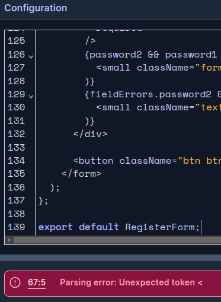           | Expected warning as expects standard JS code |
| frontend/src/components/Dash/activitysummary          | [ActivitySummary.jsx](https://github.com/AshLaw96/fit-track/blob/main/frontend/src/components/Dash/ActivitySummary.jsx)                | https://eslint.org/play  |          | Expected warning as expects standard JS code |
| frontend/src/components/Dash/challengesmotivation     | [ChallengesMotivation.jsx](https://github.com/AshLaw96/fit-track/blob/main/frontend/src/components/Dash/ChallengesMotivation.jsx)      | https://eslint.org/play  |  | Expected warning as expects standard JS code |
| frontend/src/components/Dash/dailygoals               | [DailyGoals.jsx](https://github.com/AshLaw96/fit-track/blob/main/frontend/src/components/Dash/DailyGoals.jsx)                          | https://eslint.org/play  |               | Expected warning as expects standard JS code |
| frontend/src/components/Dash/dashboard                | [Dashboard.jsx](https://github.com/AshLaw96/fit-track/blob/main/frontend/src/components/Dash/Dashboard.jsx)                            | https://eslint.org/play  |       | Expected warning as expects standard JS code |
| frontend/src/components/Dash/guestdash                | [GuestDash.jsx](https://github.com/AshLaw96/fit-track/blob/main/frontend/src/components/Dash/GuestDash.jsx)                            | https://eslint.org/play  |               | Expected warning as expects standard JS code |
| frontend/src/components/Dash/progressanalytics        | [ProgressAnalytics.jsx](https://github.com/AshLaw96/fit-track/blob/main/frontend/src/components/Dash/ProgressAnalytics.jsx)            | https://eslint.org/play  |   | Expected warning as expects standard JS code |
| frontend/src/components/Dash/userdash                 | [UserDash.jsx](https://github.com/AshLaw96/fit-track/blob/main/frontend/src/components/Dash/UserDash.jsx)                              | https://eslint.org/play  |                | Expected warning as expects standard JS code |
| frontend/src/components/Dash/workoutmodalplanner      | [WorkoutModalPlanner.jsx](https://github.com/AshLaw96/fit-track/blob/main/frontend/src/components/Dash/WorkoutModalPlanner.jsx)        | https://eslint.org/play  |          | Expected warning as expects standard JS code |
| frontend/src/components/Dash/workoutnutrition         | [WorkoutNutrition.jsx](https://github.com/AshLaw96/fit-track/blob/main/frontend/src/components/Dash/WorkoutNutrition.jsx)              | https://eslint.org/play  | 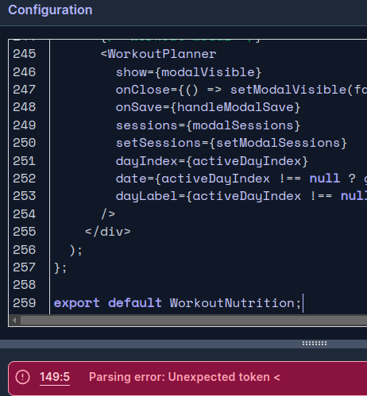     | Expected warning as expects standard JS code |
| frontend/src/components/Exercises/exerciseformmodal   | [ExerciseFormModal.jsx](https://github.com/AshLaw96/fit-track/blob/main/frontend/src/components/Exercises/ExerciseFormModal.jsx)       | https://eslint.org/play  |      | Expected warning as expects standard JS code |
| frontend/src/components/Exercises/exerciselogpage     | [ExerciseLogPage.jsx](https://github.com/AshLaw96/fit-track/blob/main/frontend/src/components/Exercises/ExerciseLogPage.jsx)           | https://eslint.org/play  |         | Expected warning as expects standard JS code |
| frontend/src/components/Help/chatwidget               | [ChatWidget.jsx](https://github.com/AshLaw96/fit-track/blob/main/frontend/src/components/Help/ChatWidget.jsx)                          | https://eslint.org/play  |         | No warnings                                  |
| frontend/src/components/Help/contactsupport           | [ContactSupport.jsx](https://github.com/AshLaw96/fit-track/blob/main/frontend/src/components/Help/ContactSupport.jsx)                  | https://eslint.org/play  | 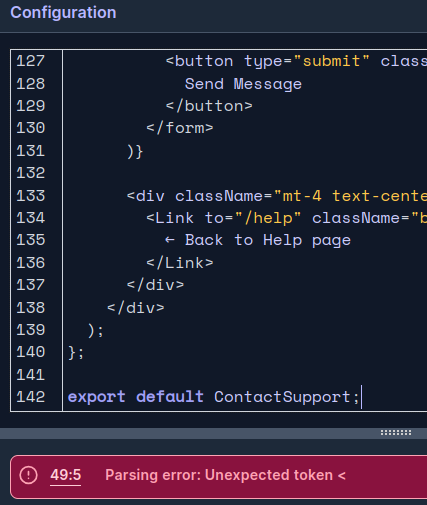            | Expected warning as expects standard JS code |
| frontend/src/components/Help/faq                      | [FAQ.jsx](https://github.com/AshLaw96/fit-track/blob/main/frontend/src/components/Help/FAQ.jsx)                                        | https://eslint.org/play  |                 | Expected warning as expects standard JS code |
| frontend/src/components/Help/faqitem                  | [FAQItem.jsx](https://github.com/AshLaw96/fit-track/blob/main/frontend/src/components/Help/FAQItem.jsx)                                | https://eslint.org/play  |            | Expected warning as expects standard JS code |
| frontend/src/components/Help/helppage                 | [HelpPage.jsx](https://github.com/AshLaw96/fit-track/blob/main/frontend/src/components/Help/HelpPage.jsx)                              | https://eslint.org/play  |           | Expected warning as expects standard JS code |
| frontend/src/components/Help/troubleshooting          | [Troubleshooting.jsx](https://github.com/AshLaw96/fit-track/blob/main/frontend/src/components/Help/Troubleshooting.jsx)                | https://eslint.org/play  |        | Expected warning as expects standard JS code |
| frontend/src/components/Help/troubleshootingitem      | [TroubleshootingItem.jsx](https://github.com/AshLaw96/fit-track/blob/main/frontend/src/components/Help/TroubleshootingItem.jsx)        | https://eslint.org/play  |   | Expected warning as expects standard JS code |
| frontend/src/components/Help/tutorialitem             | [TutorialItem.jsx](https://github.com/AshLaw96/fit-track/blob/main/frontend/src/components/Help/TutorialItem.jsx)                      | https://eslint.org/play  |       | Expected warning as expects standard JS code |
| frontend/src/components/Help/tutorials                | [Tutorials.jsx](https://github.com/AshLaw96/fit-track/blob/main/frontend/src/components/Help/Tutorials.jsx#L16)                        | https://eslint.org/play  |           | Expected warning as expects standard JS code |
| frontend/src/components/Help/tutorialsdata            | [TutorialsData.js](https://github.com/AshLaw96/fit-track/blob/main/frontend/src/components/Help/TutorialsData.js)                      | https://eslint.org/play  |       | No warnings                                  |
| frontend/src/components/Meals/mealformmodal           | [MealFormModal.jsx](https://github.com/AshLaw96/fit-track/blob/main/frontend/src/components/Meals/MealFormModal.jsx)                   | Nhttps://eslint.org/play |          | Expected warning as expects standard JS code |
| frontend/src/components/Meals/meallogpage             | [MealLogPage.jsx](https://github.com/AshLaw96/fit-track/blob/main/frontend/src/components/Meals/MealLogPage.jsx)                       | https://eslint.org/play  |           | Expected warning as expects standard JS code |
| frontend/src/components/Profile/achievementstars      | [AchievementStars.jsx](https://github.com/AshLaw96/fit-track/blob/main/frontend/src/components/Profile/AchievementStars.jsx)           | https://eslint.org/play  |        | Expected warning as expects standard JS code |
| frontend/src/components/Profile/deleteaccount         | [DeleteAccount.jsx](https://github.com/AshLaw96/fit-track/blob/main/frontend/src/components/Profile/DeleteAccount.jsx)                 | https://eslint.org/play  |      | Expected warning as expects standard JS code |
| frontend/src/components/Profile/goodbye               | [Goodbye.jsx](https://github.com/AshLaw96/fit-track/blob/main/frontend/src/components/Profile/Goodbye.jsx)                             | https://eslint.org/play  |                 | Expected warning as expects standard JS code |
| frontend/src/components/Profile/profileform           | [ProfileForm.jsx](https://github.com/AshLaw96/fit-track/blob/main/frontend/src/components/Profile/ProfileForm.jsx)                     | https://eslint.org/play  |        | Expected warning as expects standard JS code |
| frontend/src/components/Profile/profileimage          | [ProfileImage.jsx](https://github.com/AshLaw96/fit-track/blob/main/frontend/src/components/Profile/ProfileImage.jsx)                   | https://eslint.org/play  |         | Expected warning as expects standard JS code |
| frontend/src/components/Profile/quickstats            | [QuickStats.jsx](https://github.com/AshLaw96/fit-track/blob/main/frontend/src/components/Profile/QuickStats.jsx)                       | https://eslint.org/play  |               | Expected warning as expects standard JS code |
| frontend/src/components/Profile/userprofile           | [UserProfile.jsx](https://github.com/AshLaw96/fit-track/blob/main/frontend/src/components/Profile/UserProfile.jsx)                     | https://eslint.org/play  |        | Expected warning as expects standard JS code |
| frontend/src/components/Settings/changepassword       | [ChangePassword.jsx](https://github.com/AshLaw96/fit-track/blob/main/frontend/src/components/Settings/ChangePassword.jsx)              | https://eslint.org/play  |         | Expected warning as expects standard JS code |
| frontend/src/components/Settings/settingdropdown      | [SettingDropdown.jsx](https://github.com/AshLaw96/fit-track/blob/main/frontend/src/components/Settings/SettingDropdown.jsx)            | https://eslint.org/play  |            | Expected warning as expects standard JS code |
| frontend/src/components/Settings/settingspage         | [SettingsPage.jsx](https://github.com/AshLaw96/fit-track/blob/main/frontend/src/components/Settings/SettingsPage.jsx)                  | https://eslint.org/play  |          | Expected warning as expects standard JS code |
| frontend/src/components/Settings/settingtoggle        | [SettingToggle.jsx](https://github.com/AshLaw96/fit-track/blob/main/frontend/src/components/Settings/SettingToggle.jsx)                | https://eslint.org/play  | 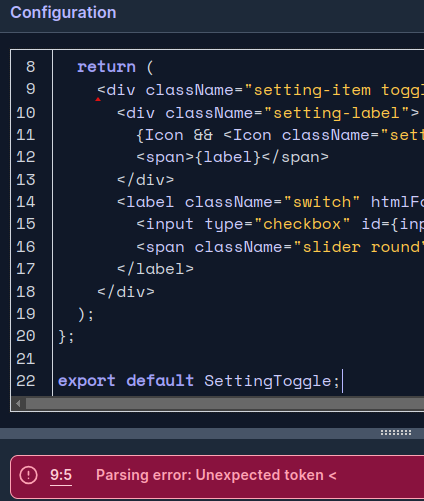             | Expected warning as expects standard JS code |
| frontend/src/components/Sleep/alarmsetting            | [AlarmSetting.jsx](https://github.com/AshLaw96/fit-track/blob/main/frontend/src/components/Sleep/AlarmSetting.jsx)                     | https://eslint.org/play  |               | Expected warning as expects standard JS code |
| frontend/src/components/Sleep/sleepencouragement      | [SleepEncouragement.jsx](https://github.com/AshLaw96/fit-track/blob/main/frontend/src/components/Sleep/SleepEncouragement.jsx)         | https://eslint.org/play  |     | Expected warning as expects standard JS code |
| frontend/src/components/Sleep/sleepformmodal          | [SleepFormModal.jsx](https://github.com/AshLaw96/fit-track/blob/main/frontend/src/components/Sleep/SleepFormModal.jsx)                 | https://eslint.org/play  |         | Expected warning as expects standard JS code |
| frontend/src/components/Sleep/sleeplogchart           | [SleepLogChart.jsx](https://github.com/AshLaw96/fit-track/blob/main/frontend/src/components/Sleep/SleepLogChart.jsx)                   | https://eslint.org/play  |         | Expected warning as expects standard JS code |
| frontend/src/components/Sleep/sleeploglist            | [SleepLogList.jsx](https://github.com/AshLaw96/fit-track/blob/main/frontend/src/components/Sleep/SleepLogList.jsx)                     | https://eslint.org/play  |          | Expected warning as expects standard JS code |
| frontend/src/components/Sleep/sleeplogpage            | [SleepLogPage.jsx](https://github.com/AshLaw96/fit-track/blob/main/frontend/src/components/Sleep/SleepLogPage.jsx)                     | https://eslint.org/play  |            | Expected warning as expects standard JS code |
| frontend/src/contexts/authcontext                     | [AuthContext.js](https://github.com/AshLaw96/fit-track/blob/main/frontend/src/contexts/AuthContext.js)                                 | https://eslint.org/play  |        | Expected warning as expects standard JS code |
| frontend/src/contexts/notificationcontext             | [NotificationContext.jsx](https://github.com/AshLaw96/fit-track/blob/main/frontend/src/contexts/NotificationContext.jsx)               | https://eslint.org/play  |       | Expected warning as expects standard JS code |
| frontend/src/contexts/themecontext                    | [ThemeContext.jsx](https://github.com/AshLaw96/fit-track/blob/main/frontend/src/contexts/ThemeContext.jsx)                             | https://eslint.org/play  |               | Expected warning as expects standard JS code |
| frontend/src/contexts/unitscontext                    | [UnitsContext.js](https://github.com/AshLaw96/fit-track/blob/main/frontend/src/contexts/UnitsContext.js)                               | https://eslint.org/play  |               | Expected warning as expects standard JS code |
| frontend/src/utils/notificationtriggers               | [NotificationTriggers.js](https://github.com/AshLaw96/fit-track/blob/main/frontend/src/utils/NotificationTriggers.js)                  | https://eslint.org/play  |      | No warnings                                  |
| frontend/src/utils/api                                | [api.js](https://github.com/AshLaw96/fit-track/blob/main/frontend/src/utils/api.js)                                                    | https://eslint.org/play  | 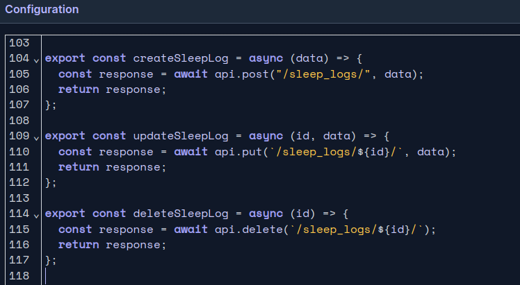                | No warnings                                  |
| frontend/src/utils/iconhelper                         | [iconHelper.js](https://github.com/AshLaw96/fit-track/blob/main/frontend/src/utils/iconHelper.js)                                      | https://eslint.org/play  |           | Expected warning as expects standard JS code |

### Python

I have used the recommended [PEP8 CI Python Linter](https://pep8ci.herokuapp.com) to validate all of my Python files.

| Directory                   | File                                                                                                   | URL                                                                                                                                              | Screenshot                                                   | Notes     |
| --------------------------- | ------------------------------------------------------------------------------------------------------ | ------------------------------------------------------------------------------------------------------------------------------------------------ | ------------------------------------------------------------ | --------- |
| api/tests/model-tests       | [models-tests.py](https://github.com/AshLaw96/fit-track/blob/main/api/tests/model-tests.py)            | [PEP8 CI Link](https://pep8ci.herokuapp.com/https://raw.githubusercontent.com/AshLaw96/fit-track/refs/heads/main/api/tests/model-tests.py)       |       | No errors |
| api/tests/serializers-tests | [serializers-tests.py](https://github.com/AshLaw96/fit-track/blob/main/api/tests/serializers-tests.py) | [PEP8 CI Link](https://pep8ci.herokuapp.com/https://raw.githubusercontent.com/AshLaw96/fit-track/refs/heads/main/api/tests/serializers-tests.py) |  | No errors |
| api/tests/view-tests        | [view-tests.py](https://github.com/AshLaw96/fit-track/blob/main/api/tests/view-tests.py)               | [PEP8 CI Link](https://pep8ci.herokuapp.com/https://raw.githubusercontent.com/AshLaw96/fit-track/refs/heads/main/api/tests/view-tests.py)        |         | No errors |
| api/utils/activity          | [activity.py](https://github.com/AshLaw96/fit-track/blob/main/api/utils/activity.py)                   | [PEP8 CI Link](https://pep8ci.herokuapp.com/https://raw.githubusercontent.com/AshLaw96/fit-track/refs/heads/main/api/utils/activity.py)          |          | No errors |
| api/utils/fitness           | [fitness.py](https://github.com/AshLaw96/fit-track/blob/main/api/utils/fitness.py)                     | [PEP8 CI Link](https://pep8ci.herokuapp.com/https://raw.githubusercontent.com/AshLaw96/fit-track/refs/heads/main/api/utils/fitness.py)           |           | No errors |
| api/utils/leaderboard       | [leaderboard.py](https://github.com/AshLaw96/fit-track/blob/main/api/utils/leaderboard.py)             | [PEP8 CI Link](https://pep8ci.herokuapp.com/https://raw.githubusercontent.com/AshLaw96/fit-track/refs/heads/main/api/utils/leaderboard.py)       |            | No errors |
| api/utils/notifications     | [notifications.py](https://github.com/AshLaw96/fit-track/blob/main/api/utils/notifications.py)         | [PEP8 CI Link](https://pep8ci.herokuapp.com/https://raw.githubusercontent.com/AshLaw96/fit-track/refs/heads/main/api/utils/notifications.py)     |            | No errors |
| api/utils/sleep             | [sleep.py](https://github.com/AshLaw96/fit-track/blob/main/api/utils/sleep.py)                         | [PEP8 CI Link](https://pep8ci.herokuapp.com/https://raw.githubusercontent.com/AshLaw96/fit-track/refs/heads/main/api/utils/sleep.py)             |             | No errors |
| api/admin                   | [admin.py](https://github.com/AshLaw96/fit-track/blob/main/api/admin.py)                               | [PEP8 CI Link](https://pep8ci.herokuapp.com/https://raw.githubusercontent.com/AshLaw96/fit-track/refs/heads/main/api/admin.py)                   |             | No errors |
| api/apps                    | [apps.py](https://github.com/AshLaw96/fit-track/blob/main/api/apps.py)                                 | [PEP8 CI Link](https://pep8ci.herokuapp.com/https://raw.githubusercontent.com/AshLaw96/fit-track/refs/heads/main/api/apps.py)                    |              | No errors |
| api/models                  | [models.py](https://github.com/AshLaw96/fit-track/blob/main/api/models.py)                             | [PEP8 CI Link](https://pep8ci.herokuapp.com/https://raw.githubusercontent.com/AshLaw96/fit-track/refs/heads/main/api/models.py)                  |             | No errors |
| api/serializers             | [serializers.py](https://github.com/AshLaw96/fit-track/blob/main/api/serializers.py)                   | [PEP8 CI Link](https://pep8ci.herokuapp.com/https://raw.githubusercontent.com/AshLaw96/fit-track/refs/heads/main/api/serializers.py)             |        | No errors |
| api/utils/signals           | [signals.py](https://github.com/AshLaw96/fit-track/blob/main/api/signals.py)                           | [PEP8 CI Link](https://pep8ci.herokuapp.com/https://raw.githubusercontent.com/AshLaw96/fit-track/refs/heads/main/api/signals.py)                 |            | No errors |
| api/tasks                   | [tasks.py](https://github.com/AshLaw96/fit-track/blob/main/api/tasks.py)                               | [PEP8 CI Link](https://pep8ci.herokuapp.com/https://raw.githubusercontent.com/AshLaw96/fit-track/refs/heads/main/api/tasks.py)                   |              | No errors |
| api/urls                    | [urls.py](https://github.com/AshLaw96/fit-track/blob/main/api/urls.py)                                 | [PEP8 CI Link](https://pep8ci.herokuapp.com/https://raw.githubusercontent.com/AshLaw96/fit-track/refs/heads/main/api/urls.py)                    |              | No errors |
| api/views                   | [views.py](https://github.com/AshLaw96/fit-track/blob/main/api/views.py)                               | [PEP8 CI Link](https://pep8ci.herokuapp.com/https://raw.githubusercontent.com/AshLaw96/fit-track/refs/heads/main/api/views.py)                   |              | No errors |
| backend/celery              | [celery.py](https://github.com/AshLaw96/fit-track/blob/main/backend/celery.py)                         | [PEP8 CI Link](https://pep8ci.herokuapp.com/https://raw.githubusercontent.com/AshLaw96/fit-track/refs/heads/main/backend/celery.py)              |            | No errors |
| backend/urls                | [urls.py](https://github.com/AshLaw96/fit-track/blob/main/backend/urls.py)                             | [PEP8 CI Link](https://pep8ci.herokuapp.com/https://raw.githubusercontent.com/AshLaw96/fit-track/refs/heads/main/backend/urls.py)                |         | No errors |

## Responsiveness

| Page                   | Mobile                                                            | Tablet                                                            | Desktop                                                              | Notes             |
| ---------------------- | ----------------------------------------------------------------- | ----------------------------------------------------------------- | -------------------------------------------------------------------- | ----------------- |
| Register               |       |       |           | Works as expected |
| Login                  |            |            |              | Works as expected |
| Profile                |        | 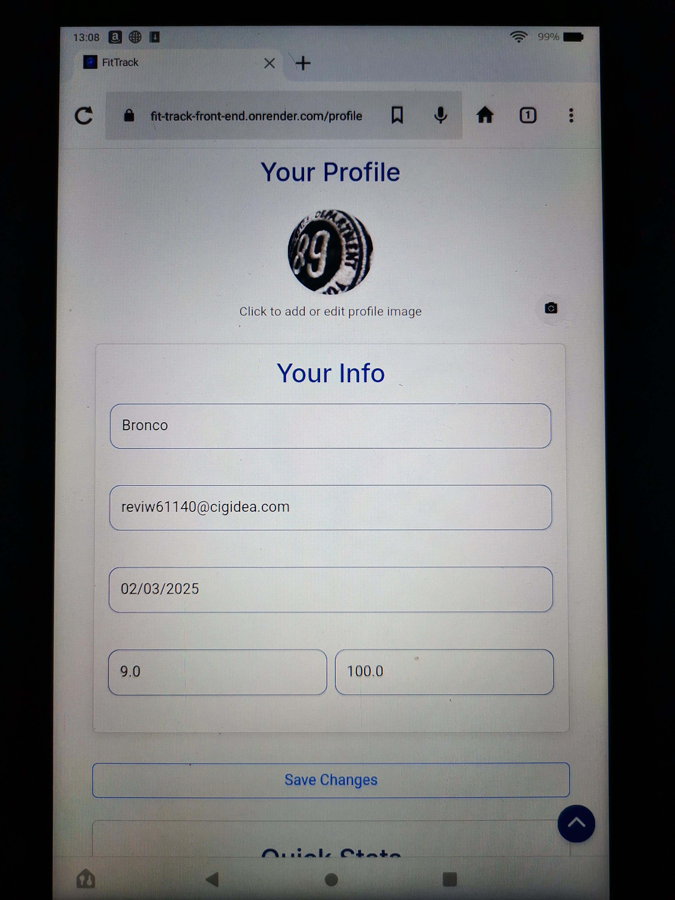       |            | Works as expected |
| Landing/GuestDash      |          |          |         | Works as expected |
| Exercise               |       |       |           | Works as expected |
| Meal                   |           |           |               | Works as expected |
| Sleep                  |          | 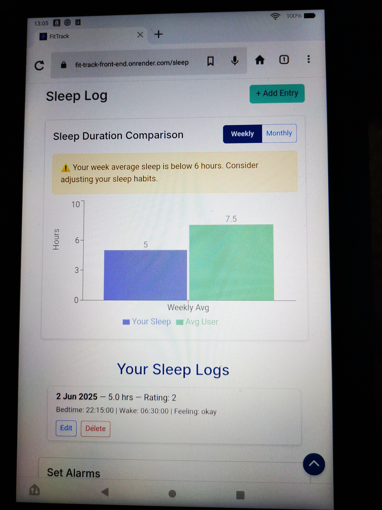         |              | Works as expected |
| Dashboard              |      | 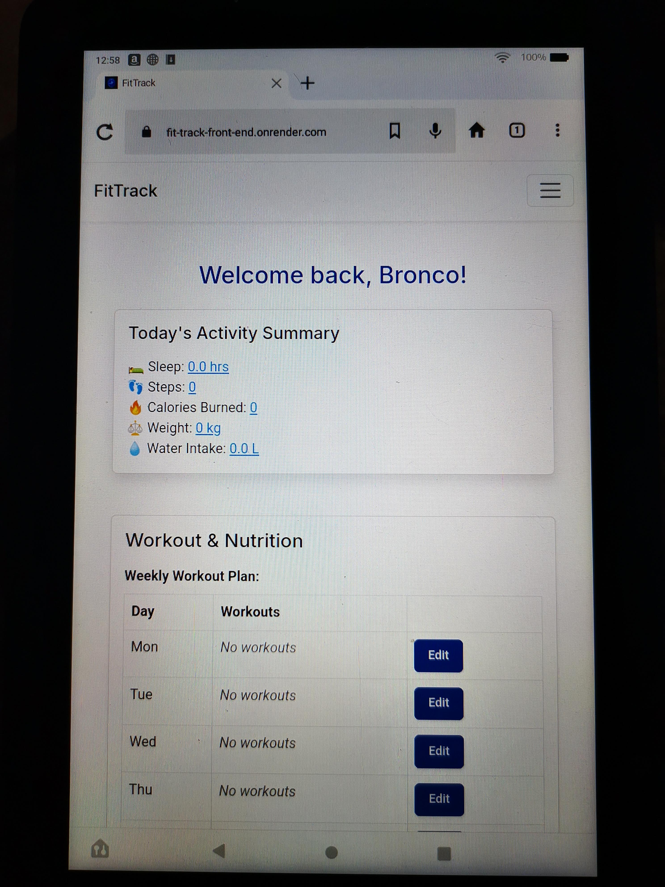     |          | Works as expected |
| Settings               |        |        |           | Works as expected |
| Help                   |           |           |       | Works as expected |
| FAQ                    |            |            |                | Works as expected |
| Contact Support        |        |        |    | Works as expected |
| Tech Support           |   |           |  | Works as expected |
| Tutorials              |          |          |     | Works as expected |
| Password reset         |          |          |              | Works as expected |
| Password reset confirm |  |  |      | Works as expected |
| 404                    |            |            |                | Works as expected |
| 500                    |            |            |                | Works as expected |

## Browser Compatibility

I've tested my deployed project on multiple browsers to check for compatibility issues.

| Page                   | Chrome                                                               | Firefox                                                         | Silk                                                              | Notes             |
| ---------------------- | -------------------------------------------------------------------- | --------------------------------------------------------------- | ----------------------------------------------------------------- | ----------------- |
| Register               |           |       |       | Works as expected |
| Login                  |              | 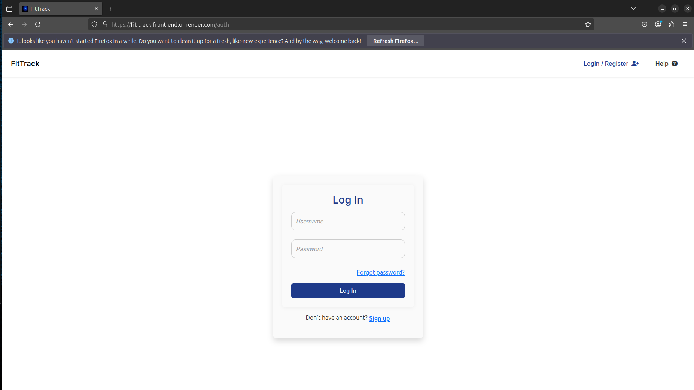           |            | Works as expected |
| Profile                |            |        |        | Works as expected |
| Landing/GuestDash      |         |          |          | Works as expected |
| Exercise               |           |       |       | Works as expected |
| Meal                   |               |           |           | Works as expected |
| Sleep                  |              |          |          | Works as expected |
| Dashboard              |          |      |      | Works as expected |
| Settings               |           |        |        | Works as expected |
| Help                   |       | 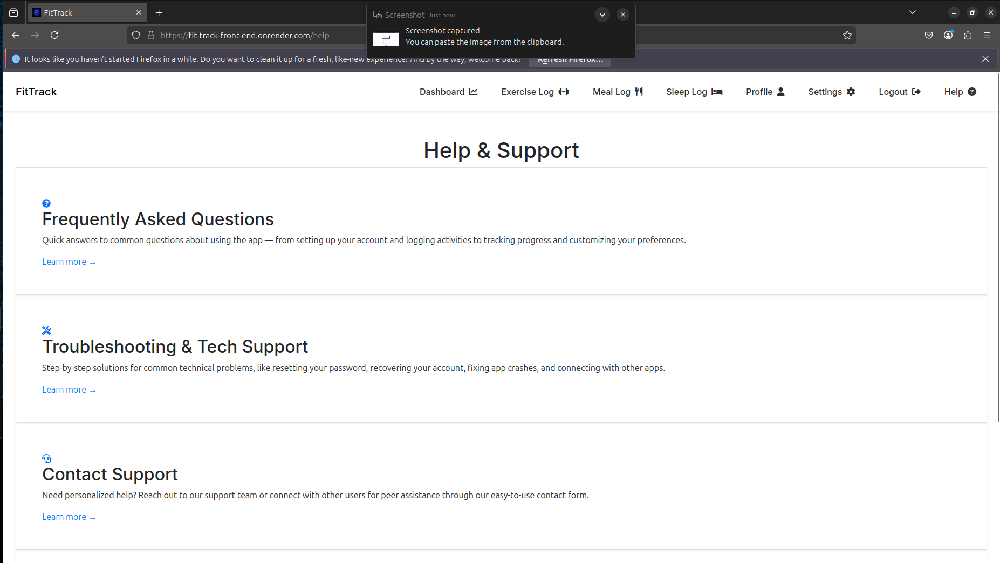          |           | Works as expected |
| FAQ                    |                |            |            | Works as expected |
| Contact support        |    |        |        | Works as expected |
| Tech support           |  |           |           | Works as expected |
| Tutorials              |     |          |          | Works as expected |
| Password reset         |              |          |          | Works as expected |
| Password reset confirm |      |  |  | Works as expected |
| 404                    |                |            |            | Works as expected |
| 500                    |                |            |            | Works as expected |

## Lighthouse Audit

I've tested my deployed project using the Lighthouse Audit tool to check for any major issues. Some warnings are outside of my control, and mobile results tend to be lower than desktop.

| Page                   | Mobile                                                        | Desktop                                                        |
| ---------------------- | ------------------------------------------------------------- | -------------------------------------------------------------- |
| Register               |            |            |
| Login                  |            |            |
| Profile                |        |        |
| Landing/GuestDash      | 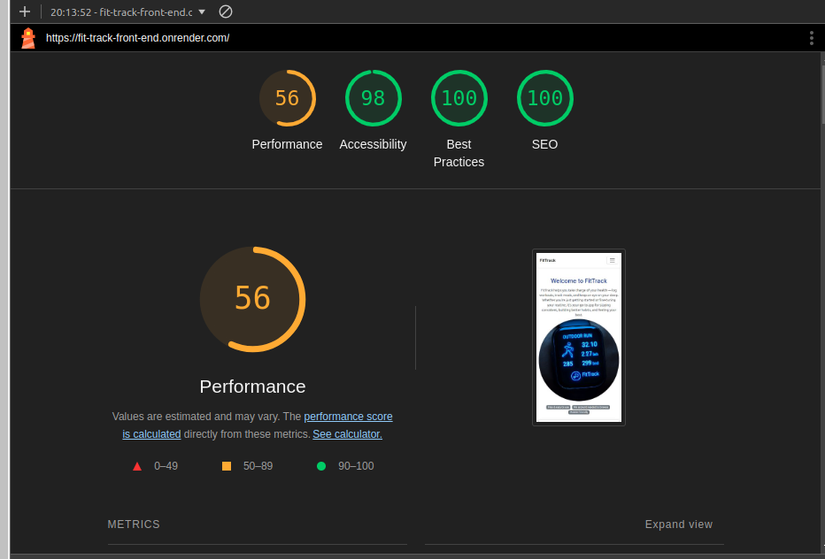         |          |
| Exercise               |       |       |
| Meal                   |           |           |
| Sleep                  |          |          |
| Setting                |        |        |
| Help                   |           |           |
| Dashboard              |           |           |
| FAQ                    |            |            |
| Tech support           |           |           |
| Contact support        |        | 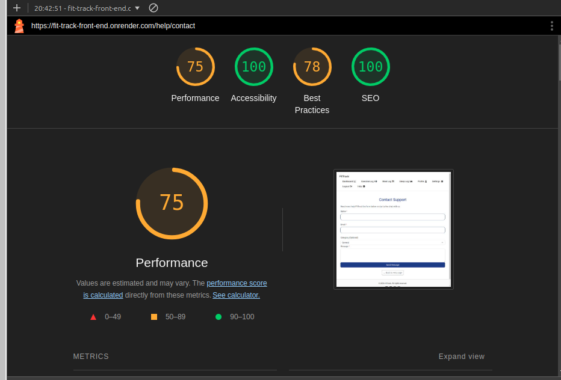       |
| Tutorial               |          |          |
| Password reset         |          |          |
| Password reset confirm |  |  |
| 404                    |            |            |

## Defensive Programming

Defensive programming was manually tested with the below user acceptance testing:

| Page                        | Expectation                                                                                                                                                                                                                                                                                                  | Test                                                                                                                                                                                                                             | Result                                                                                                                                                                                                                  | Screenshot                                                                    |
| --------------------------- | ------------------------------------------------------------------------------------------------------------------------------------------------------------------------------------------------------------------------------------------------------------------------------------------------------------ | -------------------------------------------------------------------------------------------------------------------------------------------------------------------------------------------------------------------------------- | ----------------------------------------------------------------------------------------------------------------------------------------------------------------------------------------------------------------------- | ----------------------------------------------------------------------------- |
| Register Form               | Feature is expected to allow users to register an account with correct input details then redirect to the log-in form.                                                                                                                                                                                       | Tried leaving input fields empty, wrong email structuring, different passwords to not match, too short passwords, not strong password strength and a username already used.                                                      | Each input field informed when an error or incorrect detail was inputted and when correctly inputted, it informed the user so and then redirected to the log-in form.                                                   |             |
| Log-in form                 | Feature is expected to allow registered users to sign-in to their account and be redirected to the their dashboard dashboard.                                                                                                                                                                                | Tested by inputting incorrect registered user details and non-registered details.                                                                                                                                                | Worked correctly telling the user what they inputted wrongly and when correct details were inputted redirected to their dashboard.                                                                                      |                  |
| Workout section             | Feature is expected to allow the user to add many workouts each day & edit their workout plan and at the end of the week (sunday) choose to keep the plan for the following week and they must save the plan or it doesn't stay in the workout section.                                                      | Tested by adding different workouts on different days, leaving days blank, editing different days saving the form, not saving the form, trying to click the repeat next week button on different days and clicking it on sunday. | Workout plan worked as expected, allowing add and edit, saving when it should and only allow to repeat the plan at the end of the week.                                                                                 |              |
| Daily goals                 | Feature is expected to allow user to add, edit and delete specific goals and when achieved give the user an achievement star that is shown in their profile page.                                                                                                                                            | Created different goals of different categories, tried editing and deleting the goals, leaving the input field blank and adding to the progress bar.                                                                             | As expected I could add specific goals, then edit and delete the goals, wouldn't allow to add a goal if empty, add points to the progress bar and when the goal was achieved added to the achievement specific section. |                 |
| Challenge section           | It is expected to allow users to set challenges for themselves or others if chosen and if they chose to let others it will add to other users available section so they can decide whether to do the challenge and when they achieve the challenge it will give them a point adding them to the leaderboard. | Added a challenge with both allowing public to do the challenge and not allowing, leaving input fields empty, tried adding another challenge.                                                                                    | Only one challenge at a time were added successfully, if they set to public it was shown in other users available section and when achieved awarded the current user a point putting them onto the leaderboard.         | 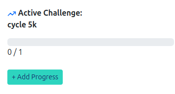           |
| Exercise filter             | Feature is expected to just show the exercise for the specific dates, (current week, current month or all) of the specific user.                                                                                                                                                                             | Created different exercise in different dates filtering each filter.                                                                                                                                                             | As expected it showed just the exercises of the dates filtered for.                                                                                                                                                     |      |
| Exercise form               | Feature is expected to allow users to add any exercises they have done for a chosen date then show it in the log and they will also be able to edit and delete any exercise they have put on and then show different content in the users dashboard.                                                         | To test I added many different types of exercise on different browsers and tried editing and deleting multiple exercises.                                                                                                        | As expected the modal allowed the user to add their exercise for any chosen day, also allowing them to edit and delete any of the created exercises and show the correct data in the correct sections of the dashboard. |        |
| Meal form                   | Feature is expected to allow users to add any meal they have done for a chosen date then show it in the log and they will also be able to edit and delete any meal they have put on and then show different content in the users dashboard.                                                                  | To test I added many different types of exercise on different browsers and tried editing and deleting multiple exercises.                                                                                                        | As expected the modal allowed the user to add their meal for any chosen day, also allowing them to edit and delete any of the created meal and show the correct data in the correct sections of the dashboard.          |                 |
| Sleep form                  | Feature is expected to allow users to add sleep details for a chosen date then show it in the log and they will also be able to edit and delete any sleep data they have put on and then show the duration content in the users dashboard.                                                                   | To test I added different sleep logs on different browsers and devices and tried editing and deleting multiple sleep logs.                                                                                                       | As expected the modal allowed the user to add their sleep log for any chosen day, also allowing them to edit and delete any of the created logs and show the correct data in the correct sections of the dashboard.     |           |
| Sleep graph                 | Feature is expected to display the users current weekly sleep average with average users sleep and be able to switch to a monthly version.                                                                                                                                                                   | Completed different sleep duration amounts for different users switching between weekly and monthly.                                                                                                                             | Successfully showed the users weekly and monthly averages correctly.                                                                                                                                                    |          |
| Sleep alarm                 | Feature is expected to allow users to set alarms for different times.                                                                                                                                                                                                                                        | Tested by adding different bedtimes and wake times for multiple users on different browsers.                                                                                                                                     | Displayed the correct times the user sets.                                                                                                                                                                              |          |
| Profile image               | Users can add any profile image from their local device then it will be saved to cloudinary.                                                                                                                                                                                                                 | Added different variety of images on different devices for different users.                                                                                                                                                      | Correctly displayed the specific users image every time.                                                                                                                                                                |          |
| Delete account              | Feature is expected to allow the user to delete their own account and then redirect them to the goodbye page.                                                                                                                                                                                                | Created many different accounts and deleted accounts on different browsers and devices.                                                                                                                                          | As expected deleted the current users account and redirected to the goodbye page.                                                                                                                                       |       |
| Change password form        | Feature is expected to allow the user to change their password as long as they remember their current password then log them out redirecting to the login page allowing them to log back in with the new password.                                                                                           | Changed the password multiple times with different users inputting incorrect current passwords and mismatch new passwords and confirm new passwords.                                                                             | As expected when incorrect details were inputted it informed the user to input correct details and when correct it redirected them to the login page allowing them to re-log in with the new password.                  |     |
| Notification toggle         | Feature is expected to allow the user to turn on or off their notification preferences.                                                                                                                                                                                                                      | Turned on and off the toggle on different devices and browsers with different users.                                                                                                                                             | Allowed notifications to be turned on or off every time.                                                                                                                                                                |          |
| Theme toggle                | Feature is expected to allow the user to turn on or off their dark theme preferences changing every page.                                                                                                                                                                                                    | Turned on and off the toggle on different devices and browsers with different users.                                                                                                                                             | Allowed theme change to be turned on or off every time changing on every page.                                                                                                                                          |                |
| Weight unit change          | Feature is expected to allow the user to change their weight unit preferences to one of the options changing throughout the site where used.                                                                                                                                                                 | Changed to different options on different users account with different devices and browsers.                                                                                                                                     | It changed where needed to the specific chosen unit every time.                                                                                                                                                         |        |
| Volume unit change          | Feature is expected to allow the user to change their volume unit preferences to one of the options changing throughout the site where used.                                                                                                                                                                 | Changed to different options on different users account with different devices and browsers.                                                                                                                                     | It changed where needed to the specific chosen unit every time.                                                                                                                                                         |         |
| Length unit change          | Feature is expected to allow the user to change their length unit preferences to one of the options changing throughout the site where used.                                                                                                                                                                 | Changed to different options on different users account with different devices and browsers.                                                                                                                                     | It changed where needed to the specific chosen unit every time.                                                                                                                                                         |        |
| Help page links             | Feature is expected to allow user to navigate to the corresponding pages.                                                                                                                                                                                                                                    | Tested by clicking each link multiple times on different devices and browsers.                                                                                                                                                   | As expected it navigated to the corresponding page every time.                                                                                                                                                          |        |
| Faq search                  | Feature is expected to allow users to navigate their question search down highlighting the letters in each question.                                                                                                                                                                                         | Inputted different characters and even numbers and special characters on different devices and browsers.                                                                                                                         | Narrowed the question search down highlight the characters/words in the provided questions.                                                                                                                             |           |
| Help pages dropdowns        | Feature is expected to close and open the dropdown question/answers on each of the help pages that have them in.                                                                                                                                                                                             | Clicked the dropdowns on each help page multiple times on different browsers and devices.                                                                                                                                        | Correctly hid and showed the answers when clicked.                                                                                                                                                                      |             |
| Back to help button         | Feature is expected to easily navigate back to the help main page.                                                                                                                                                                                                                                           | Clicked the back to help page button multiple times on each linking help page, on different devices and browsers.                                                                                                                | Correctly navigated to the main help page every time.                                                                                                                                                                   |     |
| Tech support search         | Feature is expected to allow users to navigate their question search down highlighting the letters in each question.                                                                                                                                                                                         | Inputted different characters and even numbers and special characters on different devices and browsers.                                                                                                                         | Narrowed the question search down highlight the characters/words in the provided questions.                                                                                                                             |          |
| Contact form                | Feature is expected to allow users to send a contact form if they need to get in-touch for any reason.                                                                                                                                                                                                       | Left required input fields blank and correctly inputted all required fields, also changed the optional specific options multiple times sending different forms.                                                                  | Informed the user when required fields were left empty and then correctly sent the contact form when all required fields where inputted.                                                                                | 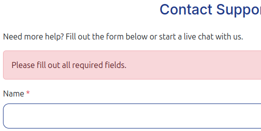        |
| Contact link                | Feature is expected to navigate the user to the contact support page.                                                                                                                                                                                                                                        | Clicked the link multiple times on different devices and browsers.                                                                                                                                                               | As expected navigated to the contact page every time.                                                                                                                                                                   |         |
| Chatbot                     | Feature is expected to help the user slightly (as free online chatbot) also closing or opening the model when clicked on.                                                                                                                                                                                    | Submitted different questions on different browsers.                                                                                                                                                                             | Correctly sent messages answering to the questions.                                                                                                                                                                     |              |
| Guide support search        | Feature is expected to allow users to navigate their question search down highlighting the letters in each question.                                                                                                                                                                                         | Inputted different characters and even numbers and special characters on different devices and browsers.                                                                                                                         | Narrowed the question search down highlight the characters/words in the provided questions.                                                                                                                             |         |
| Navbar toggle               | Feature is expected to open or close the navigation links when on smaller screens.                                                                                                                                                                                                                           | Clicked the toggle multiple times on different devices and browsers.                                                                                                                                                             | As expected opened and closed the navbar whenever clicked on.                                                                                                                                                           |           |
| FitTrack title link         | Feature is expected to navigate the user to the users dashboard (if logged in) or the guest dashboard (if not logged in).                                                                                                                                                                                    | Clicked the title multiple times both when logged in and out on different devices and browsers.                                                                                                                                  | Navigated to the correct dashboard depending if logged in or not.                                                                                                                                                       |        |
| Password reset form         | Feature is expected to allow users to input their email linked to their account and send them a reset link.                                                                                                                                                                                                  | Inputted both correct emails and incorrect emails and left the form blank.                                                                                                                                                       | As expected informed the user to input correct details or that not account was linked to the email and when correct sent the reset link to the correct email address.                                                   |           |
| Password reset link         | Feature is expected to navigate the user to the password reset page.                                                                                                                                                                                                                                         | Clicked the link multiple times on different browsers and devices.                                                                                                                                                               | Successfully navigated to the correct page every time.                                                                                                                                                                  |     |
| Password reset email link   | Feature is expected to navigate the user to the password reset confirm page.                                                                                                                                                                                                                                 | Clicked different links for different users on different browsers and devices.                                                                                                                                                   | Successfully navigated to the correct page every time.                                                                                                                                                                  |  |
| Password reset confirm form | Feature is expected to allow users to set up a new password then redirect them to the log in page.                                                                                                                                                                                                           | Left input fields blank, used incorrect password characters and inputted correct password characters.                                                                                                                            | Correctly informed user when wrong inputs or blank inputs and successfully set up the new password redirecting them to the log in page.                                                                                 |   |
| Log in link                 | Feature is supposed to allow users to navigate to the log in page.                                                                                                                                                                                                                                           | Clicked different links for different users on different browsers and devices.                                                                                                                                                   | As expected it navigates to the log in page every time.                                                                                                                                                                 |             |
| Sign up link                | Feature is supposed to allow users to navigate to the sign up page.                                                                                                                                                                                                                                          | Clicked different links for different users on different browsers and devices.                                                                                                                                                   | As expected it navigates to the sign up page every time.                                                                                                                                                                |         |
| Scroll up button            | Feature is expected to show the scroll up icon when scrolling down the screen then when clicked take them back to the top of the page.                                                                                                                                                                       | Scrolled down on every page on different devices and browsers clicking the button multiple times.                                                                                                                                | As expected showed the scroll up icon when scrolling so far down and scrolled back to the top every time.                                                                                                               |            |
| Social media links          | Feature is expected to open a new tab with the corresponding social media link.                                                                                                                                                                                                                              | Clicked each icon multiple times on different browsers and devices.                                                                                                                                                              | As expected it oped the correct social media page in a new tab every time.                                                                                                                                              |              |
| Logout modal                | Feature is expected to open the logout modal where the user can either wait the countdown to be logged out or click the log out button to be instantly logged out.                                                                                                                                           | Clicked the logout link button multiple times on different devices and browsers.                                                                                                                                                 | As expected it opened the logout modal every time and navigated the user to the log in page.                                                                                                                            |               |
| Exercise url auth           | Feature is expected to not allow non users to navigate to the exercise page by typing the url in.                                                                                                                                                                                                            | Tried navigating to the exercise the page when not logged in, with typing in the url on different devices and browsers.                                                                                                          | Didn't allow the user to do anything on the page as expected.                                                                                                                                                           |              |
| Sleep url auth              | Feature is expected to not allow non users to navigate to the sleep page by typing the url in.                                                                                                                                                                                                               | Tried navigating to the sleep the page when not logged in, with typing in the url on different devices and browsers.                                                                                                             | Didn't allow the user to do anything on the page as expected.                                                                                                                                                           | 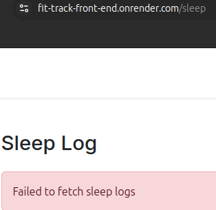                |
| Meal url auth               | Feature is expected to not allow non users to navigate to the meal page by typing the url in.                                                                                                                                                                                                                | Tried navigating to the meal the page when not logged in, with typing in the url on different devices and browsers.                                                                                                              | Didn't allow the user to do anything on the page as expected.                                                                                                                                                           |                               |
| Profile url auth            | Feature is expected to not allow non users to navigate to the profile page by typing the url in.                                                                                                                                                                                                             | Tried navigating to the exercise the page when not logged in, with typing in the url on different devices and browsers.                                                                                                          | Didn't allow the user to do anything on the page as expected.                                                                                                                                                           |               |
| Setting url auth            | Feature is expected to not allow non users to navigate to the settings page by typing the url in.                                                                                                                                                                                                            | Tried navigating to the settings the page when not logged in, with typing in the url on different devices and browsers.                                                                                                          | Didn't allow the user to do anything on the page as expected.                                                                                                                                                           |                               |
| Guest page nav links        | Feature is expected to only show the guest dash, log in/register pages and the help page.                                                                                                                                                                                                                    | viewed the navbar when logged out on different devices and browsers.                                                                                                                                                             | Only displayed the correct 3 mentioned pages as expected.                                                                                                                                                               |         |
| 404 Error Page              | Feature is expected to display a 404 error page for non-existent pages.                                                                                                                                                                                                                                      | Navigated to an invalid URL (e.g., `/test`).                                                                                                                                                                                     | A custom 404 error page was displayed as expected.                                                                                                                                                                      |                  |
| 500 Error Page              | Feature is expected to display a 500 error page for when service errors occur.                                                                                                                                                                                                                               | Manually created a test view.                                                                                                                                                                                                    | A custom 500 error page was displayed as expected.                                                                                                                                                                      |                                  |

#### Back-End Testing

| Step | What testing                              | URL                                               | HTTP Method | Headers                            | Body    | Outcome                                                     | Screenshot                                                                        |
| ---- | ----------------------------------------- | ------------------------------------------------- | ----------- | ---------------------------------- | ------- | ----------------------------------------------------------- | --------------------------------------------------------------------------------- | --- |
| 1    | Register new user                         | `http://127.0.0.1:8000/api/register/`             | POST        | Content-Type: application/json     | JSON    | Worked correctly                                            |               |
| 2    | Login (token)                             | `http://127.0.0.1:8000/api/token/`                | POST        | Content-Type: application/json     | JSON    | Worked correctly and returned the refresh and access tokens |                  |
| 3    | Refresh token                             | `http://127.0.0.1:8000/api/token/refresh/`        | POST        | Content-Type: application/json     | JSON    | Worked correctly                                            |                |
| 4    | View profile (authenticated)              | `http://127.0.0.1:8000/api/profile/`              | GET         | Authorization: Bearer ACCESS_TOKEN | No body | Worked correctly                                            |                |
| 5    | View goals (authenticated)                | `http://127.0.0.1:8000/api/goals/`                | GET         | Authorization: Bearer ACCESS_TOKEN | No body | Worked correctly                                            |               |
| 6    | View meals (authenticated)                | `http://127.0.0.1:8000/api/meals/`                | GET         | Authorization: Bearer ACCESS_TOKEN | No body | Worked correctly                                            |              |
| 7    | View sleep_logs (authenticated)           | `http://127.0.0.1:8000/api/sleep_logs/`           | GET         | Authorization: Bearer ACCESS_TOKEN | No body | Worked correctly                                            |         |
| 8    | View nutrition_logs (authenticated)       | `http://127.0.0.1:8000/api/nutrition_logs/`       | GET         | Authorization: Bearer ACCESS_TOKEN | No body | Worked correctly                                            |          |
| 9    | View achievements (authenticated)         | `http://127.0.0.1:8000/api/achievements/`         | GET         | Authorization: Bearer ACCESS_TOKEN | No body | Worked correctly                                            |            |
| 10   | View activity (authenticated)             | `http://127.0.0.1:8000/api/activity/`             | GET         | Authorization: Bearer ACCESS_TOKEN | No body | Worked correctly                                            |           |
| 11   | View progress (authenticated)             | `http://127.0.0.1:8000/api/progress/`             | GET         | Authorization: Bearer ACCESS_TOKEN | No body | Worked correctly                                            |           |
| 12   | View streak (authenticated)               | `http://127.0.0.1:8000/api/streak/`               | GET         | Authorization: Bearer ACCESS_TOKEN | No body | Worked correctly                                            |                 |
| 13   | View daily_logs (authenticated)           | `http://127.0.0.1:8000/api/daily_logs/`           | GET         | Authorization: Bearer ACCESS_TOKEN | No body | Worked correctly                                            |           |
| 14   | View challenges (authenticated)           | `http://127.0.0.1:8000/api/challenges/`           | GET         | Authorization: Bearer ACCESS_TOKEN | No body | Worked correctly                                            |         |
| 15   | View user_challenges (authenticated)      | `http://127.0.0.1:8000/api/user_challenges/`      | GET         | Authorization: Bearer ACCESS_TOKEN | No body | Worked correctly                                            |    |
| 16   | View user_reports (authenticated)         | `http://127.0.0.1:8000/api/user_reports/`         | GET         | Authorization: Bearer ACCESS_TOKEN | No body | Worked correctly                                            |            |
| 17   | View friends (authenticated)              | `http://127.0.0.1:8000/api/friends/`              | GET         | Authorization: Bearer ACCESS_TOKEN | No body | Worked correctly                                            |            |
| 17   | View workout_plans (authenticated)        | `http://127.0.0.1:8000/api/workout_plans/`        | GET         | Authorization: Bearer ACCESS_TOKEN | No body | Worked correctly                                            |            |
| 18   | Add goals (authenticated)                 | `http://127.0.0.1:8000/api/goals/`                | POST        | Authorization: Bearer ACCESS_TOKEN | JSON    | Worked correctly                                            |             |
| 19   | Add meals (authenticated)                 | `http://127.0.0.1:8000/api/meals/`                | POST        | Authorization: Bearer ACCESS_TOKEN | JSON    | Worked correctly                                            |              |
| 20   | Add sleep_logs (authenticated)            | `http://127.0.0.1:8000/api/sleep_logs/`           | POST        | Authorization: Bearer ACCESS_TOKEN | JSON    | Worked correctly                                            |             |
| 21   | Add nutrition_logs (authenticated)        | `http://127.0.0.1:8000/api/nutrition_logs/`       | POST        | Authorization: Bearer ACCESS_TOKEN | JSON    | Worked correctly                                            |         |
| 22   | Add achievements (authenticated)          | `http://127.0.0.1:8000/api/achievements/`         | POST        | Authorization: Bearer ACCESS_TOKEN | JSON    | Worked correctly                                            |           |
| 23   | Add activity (authenticated)              | `http://127.0.0.1:8000/api/activity/`             | POST        | Authorization: Bearer ACCESS_TOKEN | JSON    | Worked correctly                                            |          |
| 24   | Add progress (authenticated)              | `http://127.0.0.1:8000/api/progress/`             | POST        | Authorization: Bearer ACCESS_TOKEN | JSON    | Worked correctly                                            |          |
| 25   | Add streak (authenticated)                | `http://127.0.0.1:8000/api/streak/`               | POST        | Authorization: Bearer ACCESS_TOKEN | JSON    | Worked correctly                                            |            |
| 26   | Add daily_logs (authenticated)            | `http://127.0.0.1:8000/api/daily_logs/`           | POST        | Authorization: Bearer ACCESS_TOKEN | JSON    | Worked correctly                                            |             |
| 27   | Add challenges (authenticated)            | `http://127.0.0.1:8000/api/challenges/`           | POST        | Authorization: Bearer ACCESS_TOKEN | JSON    | Worked correctly                                            |         |
| 28   | Add user_challenges (authenticated)       | `http://127.0.0.1:8000/api/user_challenges/`      | POST        | Authorization: Bearer ACCESS_TOKEN | JSON    | Worked correctly                                            |    |
| 29   | Add user_reports (authenticated)          | `http://127.0.0.1:8000/api/user_reports/`         | POST        | Authorization: Bearer ACCESS_TOKEN | JSON    | Worked correctly                                            |            |
| 30   | Add friends (authenticated)               | `http://127.0.0.1:8000/api/friends/`              | POST        | Authorization: Bearer ACCESS_TOKEN | JSON    | Worked correctly                                            |            |
| 31   | Add workout_plans (authenticated)         | `http://127.0.0.1:8000/api/workout_plans/`        | POST        | Authorization: Bearer ACCESS_TOKEN | JSON    | Worked correctly                                            |           |
| 32   | Update all goal (authenticated)           | `http://127.0.0.1:8000/api/goals/<ID>/`           | PUT         | Authorization: Bearer ACCESS_TOKEN | JSON    | Worked correctly                                            |              |
| 33   | Update all meal (authenticated)           | `http://127.0.0.1:8000/api/meals/<ID>/`           | PUT         | Authorization: Bearer ACCESS_TOKEN | JSON    | Worked correctly                                            |               |
| 34   | Update all sleep_log (authenticated)      | `http://127.0.0.1:8000/api/sleep_logs/<ID>/`      | PUT         | Authorization: Bearer ACCESS_TOKEN | JSON    | Worked correctly                                            |              |
| 35   | Update all nutrition_log (authenticated)  | `http://127.0.0.1:8000/api/nutrition_logs/<ID>/`  | PUT         | Authorization: Bearer ACCESS_TOKEN | JSON    | Worked correctly                                            |          |
| 36   | Update all achievement (authenticated)    | `http://127.0.0.1:8000/api/achievements/<ID>/`    | PUT         | Authorization: Bearer ACCESS_TOKEN | JSON    | Worked correctly                                            |            |
| 37   | Update all activity (authenticated)       | `http://127.0.0.1:8000/api/activity/<ID>/`        | PUT         | Authorization: Bearer ACCESS_TOKEN | JSON    | Worked correctly                                            |             |
| 38   | Update all progress (authenticated)       | `http://127.0.0.1:8000/api/progress/<ID>/`        | PUT         | Authorization: Bearer ACCESS_TOKEN | JSON    | Worked correctly                                            |           |     |
| 39   | Update all daily_log (authenticated)      | `http://127.0.0.1:8000/api/daily_logs/<ID>/`      | PUT         | Authorization: Bearer ACCESS_TOKEN | JSON    | Worked correctly                                            |              |
| 40   | Update all challenge (authenticated)      | `http://127.0.0.1:8000/api/challenges/<ID>/`      | PUT         | Authorization: Bearer ACCESS_TOKEN | JSON    | Worked correctly                                            |          |
| 41   | Update all user_challenge (authenticated) | `http://127.0.0.1:8000/api/user_challenges/<ID>/` | PUT         | Authorization: Bearer ACCESS_TOKEN | JSON    | Worked correctly                                            |      |
| 42   | Update all user_report (authenticated)    | `http://127.0.0.1:8000/api/user_reports/<ID>/`    | PUT         | Authorization: Bearer ACCESS_TOKEN | JSON    | Worked correctly                                            |             |
| 43   | Update all workout_plan (authenticated)   | `http://127.0.0.1:8000/api/workout_plans/<ID>/`   | PUT         | Authorization: Bearer ACCESS_TOKEN | JSON    | Worked correctly                                            |            |
| 44   | Update goal (authenticated)               | `http://127.0.0.1:8000/api/goals/<ID>/`           | PATCH       | Authorization: Bearer ACCESS_TOKEN | JSON    | Worked correctly                                            |            |
| 45   | Update meal (authenticated)               | `http://127.0.0.1:8000/api/meals/<ID>/`           | PATCH       | Authorization: Bearer ACCESS_TOKEN | JSON    | Worked correctly                                            |             |
| 46   | Update sleep_log (authenticated)          | `http://127.0.0.1:8000/api/sleep_logs/<ID>/`      | PATCH       | Authorization: Bearer ACCESS_TOKEN | JSON    | Worked correctly                                            |            |
| 47   | Update nutrition_log (authenticated)      | `http://127.0.0.1:8000/api/nutrition_logs/<ID>/`  | PATCH       | Authorization: Bearer ACCESS_TOKEN | JSON    | Worked correctly                                            |        |
| 48   | Update achievements (authenticated)       | `http://127.0.0.1:8000/api/achievements/<ID>/`    | PATCH       | Authorization: Bearer ACCESS_TOKEN | JSON    | Worked correctly                                            |          |
| 49   | Update activity (authenticated)           | `http://127.0.0.1:8000/api/activity/<ID>/`        | PATCH       | Authorization: Bearer ACCESS_TOKEN | JSON    | Worked correctly                                            |           |
| 50   | Update progress (authenticated)           | `http://127.0.0.1:8000/api/progress/<ID>/`        | PATCH       | Authorization: Bearer ACCESS_TOKEN | JSON    | Worked correctly                                            |         |     |
| 51   | Update daily_log (authenticated)          | `http://127.0.0.1:8000/api/daily_logs/<ID>/`      | PATCH       | Authorization: Bearer ACCESS_TOKEN | JSON    | Worked correctly                                            |            |
| 52   | Update challenge (authenticated)          | `http://127.0.0.1:8000/api/challenges/<ID>/`      | PATCH       | Authorization: Bearer ACCESS_TOKEN | JSON    | Worked correctly                                            |        |
| 53   | Update user_challenge (authenticated)     | `http://127.0.0.1:8000/api/user_challenges/<ID>/` | PATCH       | Authorization: Bearer ACCESS_TOKEN | JSON    | Worked correctly                                            |   |
| 54   | Update user_report (authenticated)        | `http://127.0.0.1:8000/api/user_reports/<ID>/`    | PATCH       | Authorization: Bearer ACCESS_TOKEN | JSON    | Worked correctly                                            |           |
| 55   | Update workout_plans (authenticated)      | `http://127.0.0.1:8000/api/workout_plans/<ID>/`   | PATCH       | Authorization: Bearer ACCESS_TOKEN | JSON    | Worked correctly                                            |          |
| 56   | Remove goals (authenticated)              | `http://127.0.0.1:8000/api/goals/<ID>/`           | DELETE      | Authorization: Bearer ACCESS_TOKEN | JSON    | Worked correctly                                            |           |
| 57   | Remove meals (authenticated)              | `http://127.0.0.1:8000/api/meals/<ID>/`           | DELETE      | Authorization: Bearer ACCESS_TOKEN | JSON    | Worked correctly                                            |            |
| 58   | Remove sleep_logs (authenticated)         | `http://127.0.0.1:8000/api/sleep_logs/<ID>/`      | DELETE      | Authorization: Bearer ACCESS_TOKEN | JSON    | Worked correctly                                            |           |
| 59   | Remove nutrition_logs (authenticated)     | `http://127.0.0.1:8000/api/nutrition_logs/<ID>/`  | DELETE      | Authorization: Bearer ACCESS_TOKEN | JSON    | Worked correctly                                            |       |
| 60   | Remove achievements (authenticated)       | `http://127.0.0.1:8000/api/achievements/<ID>/`    | DELETE      | Authorization: Bearer ACCESS_TOKEN | JSON    | Worked correctly                                            |         |
| 61   | Remove progress (authenticated)           | `http://127.0.0.1:8000/api/progress/<ID>/`        | DELETE      | Authorization: Bearer ACCESS_TOKEN | JSON    | Worked correctly                                            |        |     |
| 62   | Remove daily_logs (authenticated)         | `http://127.0.0.1:8000/api/daily_logs/<ID>/`      | DELETE      | Authorization: Bearer ACCESS_TOKEN | JSON    | Worked correctly                                            |           |
| 63   | Remove challenges (authenticated)         | `http://127.0.0.1:8000/api/challenges/<ID>/`      | DELETE      | Authorization: Bearer ACCESS_TOKEN | JSON    | Worked correctly                                            |       |
| 64   | Remove user_challenges (authenticated)    | `http://127.0.0.1:8000/api/user_challenges/<ID>/` | DELETE      | Authorization: Bearer ACCESS_TOKEN | JSON    | Worked correctly                                            |  |
| 65   | Remove user_reports (authenticated)       | `http://127.0.0.1:8000/api/user_reports/<ID>/`    | DELETE      | Authorization: Bearer ACCESS_TOKEN | JSON    | Worked correctly                                            |          |
| 66   | Remove friends (authenticated)            | `http://127.0.0.1:8000/api/friends/<ID>/`         | DELETE      | Authorization: Bearer ACCESS_TOKEN | JSON    | Worked correctly                                            |          |
| 77   | Remove workout_plans (authenticated)      | `http://127.0.0.1:8000/api/workout_plans/<ID>/`   | DELETE      | Authorization: Bearer ACCESS_TOKEN | JSON    | Worked correctly                                            |         |

- As expected when no token was added e.g. an unauthorised user, each endpoint which required authorisation showed a 401 error code.

## User Story Testing

| Target               | Expectation                                                          | Outcome                                                                  | Screenshot                                                      |
| -------------------- | -------------------------------------------------------------------- | ------------------------------------------------------------------------ | --------------------------------------------------------------- |
| As a user            | I can set sleep goals                                                | so that I can aim for an optimal amount of sleep each night.             |           |
| As a user            | I can view my sleep history                                          | so that I can analyse my sleeping patterns over time.                    |        |
| As a user            | I can log my sleep duration                                          | so that I can keep track of how many hours I sleep each night.           |       |
| As a user            | I can receive personalised nutrition recommendations                 | so that I can update my dietary preferences and goals.                   |             |
| As a user            | I can track my progress towards meeting my fitness goals             | so that I can adjust my actions accordingly.                             |        |
| As a user            | I can set fitness goals                                              | so that I can clear targets to aim for in my fitness journey.            |             |
| As a user            | I can view my meal logging history and overall calorie intake        | so that I can maintain or adjust my diet as necessary.                   |         |
| As a user            | I can view my workout history                                        | so that I can see my activity levels over time.                          |          |
| As a user            | I can reset my password if I forget it                               | so that I can regain access to my account.                               |       |
| As a user            | I can log my workouts                                                | so that I can track the types of exercises I perform and their duration. |         |
| As a user            | I can log my meals                                                   | so that I can monitor my nutritional information.                        |             |
| As a new user        | I can register an account                                            | so that I can log in to the system.                                      | 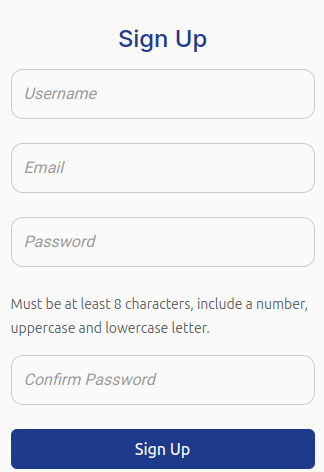             |
| As a registered user | I can log in to my account                                           | so that I can access my fitness data.                                    |               |
| As a logged-in user  | I can manage my profile                                              | so that I can update my personal information.                            |       |
| As a user            | I can analyse my workout history and meal data                       | so that I can identify trends in my fitness activities.                  |       |
| As a user            | I can use the app on my mobile device                                | so that I can track my fitness progress on the go.                       |    |
| As a user            | I can create my own fitness challenges                               | so that I can engage friends or other users.                             |        |
| As an admin          | I can analyse user activity trends                                   | so that I can understand community engagement and areas for improvement. |  |
| As an admin          | I can have the ability to review and moderate user-generated content | so that I can ensure community guidelines are met.                       |         |
| As a user            | I can join fitness challenges                                        | so that I can compete with others and reach my goals more effectively.   |       |

## Automated Testing

I have conducted a series of automated tests on my application.

> [!NOTE]
> I fully acknowledge and understand that, in a real-world scenario, an extensive set of additional tests would be more comprehensive.

### JavaScript (Jest Testing)

 INSTRUCTIONS 

Adjust the code below (file names, function names, etc.) to match your own project files/folders. Use these notes loosely when documenting your own Jest procedures, and remove/adjust where applicable.

 SAMPLE 

I have used the [Jest](https://jestjs.io) JavaScript testing framework to test the application functionality. In order to work with Jest, I first had to initialize NPM.

- `npm init`
- Hit `<enter>` for all options, except for **test command:**, just type `jest`.

Add Jest to a list called **Dev Dependencies** in a dev environment:

- `npm install --save-dev jest`

**IMPORTANT**: Initial configurations

When creating test files, the name of the file needs to be `file-name.test.js` in order for Jest to properly work. Without the following, Jest won't properly run the tests:

- `npm install -D jest-environment-jsdom`

Due to a change in Jest's default configuration, you'll need to add the following code to the top of the `.test.js` file:

```js
/**
 * @jest-environment jsdom
 */

const { test, expect } = require("@jest/globals");
const { function1, function2, function3, etc. } = require("../script-name");

beforeAll(() => {
    let fs = require("fs");
    let fileContents = fs.readFileSync("index.html", "utf-8");
    document.open();
    document.write(fileContents);
    document.close();
});
```

Remember to adjust the `fs.readFileSync()` to the specific file you'd like you test. The example above is testing the `index.html` file.

Finally, at the bottom of the script file where your primary scripts are written, include the following at the very bottom of the file. Make sure to include the name of all of your functions that are being tested in the `.test.js` file.

```js
if (typeof module !== "undefined") module.exports = {
    function1, function2, function3, etc.
};
```

Now that these steps have been undertaken, further tests can be written, and be expected to fail initially. Write JS code that can get the tests to pass as part of the Red-Green refactor process. Once ready, to run the tests, use this command:

- `npm test`

**NOTE**: To obtain a coverage report, use the following command:

- `npm test --coverage`

Below are the results from the tests that I've written for this application:

| Test Suites | Tests     | Screenshot                                                |
| ----------- | --------- | --------------------------------------------------------- |
| 1 passed    | 16 passed |  |

#### Jest Test Issues

 INSTRUCTIONS 

Use this section to list any known issues you ran into while writing your Jest tests. Remember to include screenshots (where possible), and a solution to the issue (if known). This can be used for both "fixed" and "unresolved" issues. Remove this sub-section entirely if you somehow didn't run into any issues while working with Jest.

 --- END --- 

## Bugs

 INSTRUCTIONS 

Nobody likes bugs,... except the assessors! Projects seem more suspicious if a student doesn't properly track their bugs. If you're about to submit your project without any bugs listed below, you should ask yourself why you're doing this course in the first place, if you're able to build this entire application without running into any bugs. The best thing you can do for any project is to document your bugs! Not only does it show the true stages of development, but think of it as breadcrumbs for yourself in the future, should you encounter the same/similar bug again, it acts as a gentle reminder on what you did to fix the bug.

If/when you encounter bugs during the development stages of your project, you should document them here, ideally with a screenshot explaining what the issue was, and what you did to fix the bug.

Alternatively, an improved way to manage bugs is to use the built-in **[Issues](https://www.github.com/AshLaw96/fit-track/issues)** tracker on your GitHub repository. This can be found at the top of your repository, the tab called "Issues".

If using the Issues tracker for bug management, you can simplify the documentation process for testing. Issues allow you to directly paste screenshots into the issue page without having to first save the screenshot locally. You can add labels to your issues (e.g. `bug`), assign yourself as the owner, and add comments/updates as you progress with fixing the issue(s). Once you've solved the issue/bug, you should then "Close" it.

When showcasing your bug tracking for assessment, you can use the following examples below.

 --- END --- 

### Fixed Bugs

[](https://www.github.com/AshLaw96/fit-track/issues?q=is%3Aissue+is%3Aclosed+label%3Abug)

I've used [GitHub Issues](https://www.github.com/AshLaw96/fit-track/issues) to track and manage bugs and issues during the development stages of my project.

All previously closed/fixed bugs can be tracked [here](https://www.github.com/AshLaw96/fit-track/issues?q=is%3Aissue+is%3Aclosed+label%3Abug).


### Unfixed Bugs

 INSTRUCTIONS 

You will need to mention any unfixed bugs and why they are not fixed upon submission of your project. This section should include shortcomings of the frameworks or technologies used. Although time can be a big variable to consider, paucity of time and difficulty understanding implementation is not a valid reason to leave bugs unfixed. Where possible, you must fix all outstanding bugs, unless outside of your control.

If you've identified any unfixed bugs, no matter how small, be sure to list them here! It's better to be honest and list them, because if it's not documented and an assessor finds the issue, they need to know whether or not you're aware of them as well, and why you've not corrected/fixed them.

 --- END --- 

[](https://www.github.com/AshLaw96/fit-track/issues)

Any remaining open issues can be tracked [here](https://www.github.com/AshLaw96/fit-track/issues).


### Known Issues

| Issue                                                                                                                             | Screenshot                                               |
| --------------------------------------------------------------------------------------------------------------------------------- | -------------------------------------------------------- |
| On devices smaller than 375px, the page starts to have horizontal `overflow-x` scrolling.                                         |          |
| When validating HTML with a semantic `<section>` element, the validator warns about lacking a header `h2-h6`. This is acceptable. |    |
| Validation errors on "signup.html" coming from the Django Allauth package.                                                        |           |
| With a known order-number, users can brute-force "checkout_success.html" and see potentially sensitive information.               |  |
| If a product is in your bag/cart, but then gets deleted from the database, it throws errors from the session storage memory.      |   |
| The `-`/`+` quantity buttons work well on "product_details.html", but not on "bag.html".                                          |  |

> [!IMPORTANT]
> There are no remaining bugs that I am aware of, though, even after thorough testing, I cannot rule out the possibility.
